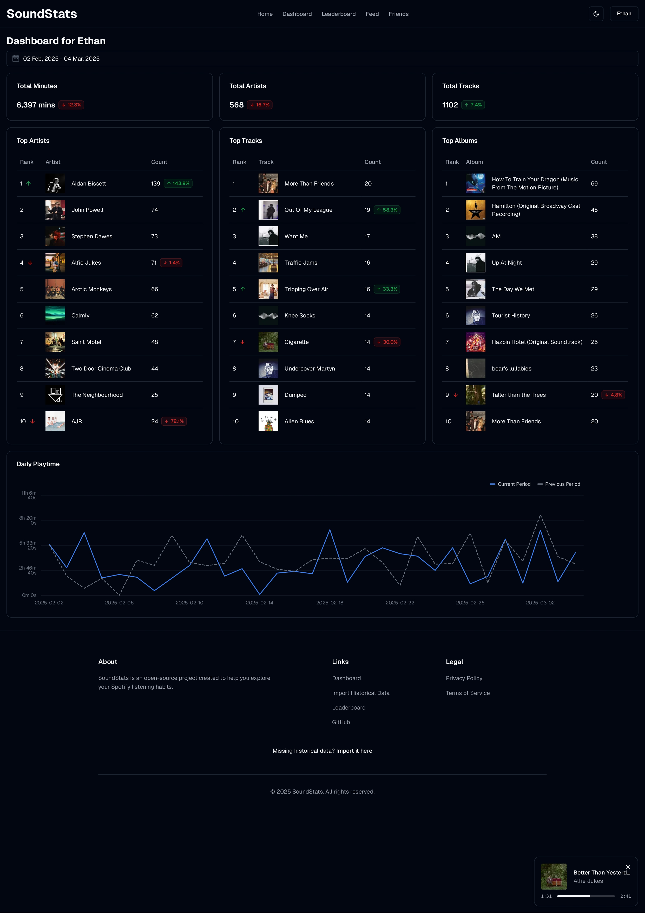
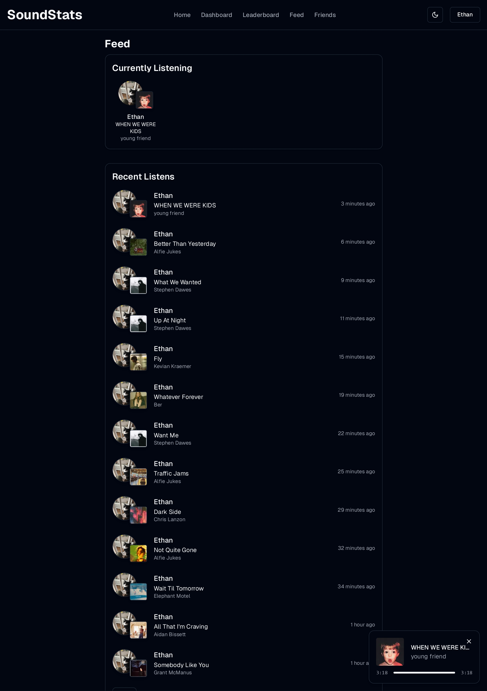
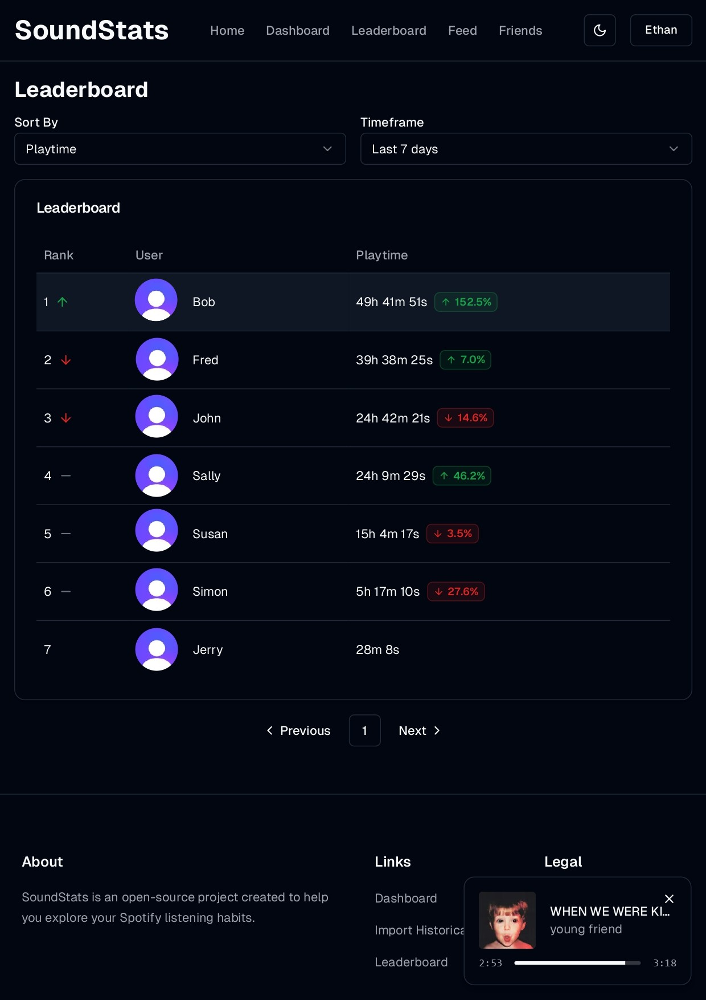

# SoundStats: Spotify Statistics, Reimagined

SoundStats provides deep insights into your Spotify listening habits with detailed analytics, visualizations, and social features. Track your music journey beyond what Spotify Wrapped offers, available year-round.

## Features

### Comprehensive Analytics Dashboard

- View your top artists, tracks, and albums with detailed statistics
- Explore daily listening patterns with interactive graphs
- Filter analytics by custom date ranges
- Compare current stats with previous periods



### Social Experience

- Connect with friends to see what they're listening to
- Compare music tastes through dynamic leaderboards
- View a real-time feed of your friends' current and recent tracks
- Discover new music through your friends' listening habits





### Historical Data Import

- Upload your Spotify data exports to see your complete listening history
- Access analytics that go back further than Spotify's API allows
- Get insights from your entire Spotify journey

### Real-time Tracking

- See what's playing right now for you and your friends
- Automatically updated statistics that stay current with your listening
- Track your listening journey as it happens

## Technology

SoundStats is built with modern web technologies:

- **Frontend**: Next.js, React, TypeScript, Tailwind CSS
- **Backend**: Next.js API routes, PostgreSQL with Drizzle ORM
- **Authentication**: Clerk
- **Data Visualization**: Recharts (via tremor.so)
- **API Integration**: Spotify Web API

## Getting Started

### Prerequisites

- Node.js 18+ and pnpm
- PostgreSQL database
- Spotify Developer account
- Clerk account

### Local Development

```bash
# Install dependencies
pnpm install

# Set up environment variables
cp .env.example .env.local

# Run development server
pnpm dev
```

## Roadmap

See the issues page on GitHub for future roadmap items.

## License

[MIT License](LICENSE)

## Acknowledgments

- Built with [Next.js](https://nextjs.org/)
- Authentication by [Clerk](https://clerk.dev/)
- UI components from [shadcn/ui](https://ui.shadcn.com/)
- Powered by the [Spotify Web API](https://developer.spotify.com/documentation/web-api/)
